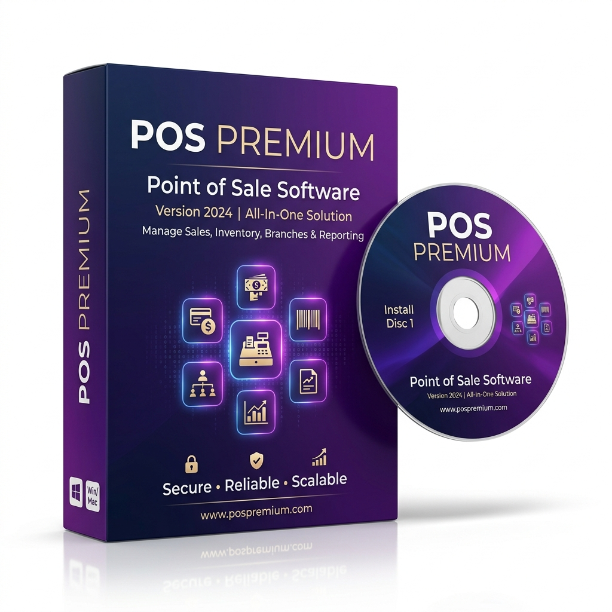

# POS Premium (PHP Kasir)



Aplikasi Point of Sale (Kasir) premium berbasis web yang dikembangkan menggunakan PHP native, MySQL, dan Bootstrap 5. Aplikasi ini dilengkapi dengan sistem Role-Based Access Control (RBAC) dinamis, manajemen multi-cabang, sistem lisensi bertingkat, manajemen utang piutang, dan dukungan Dark Mode/Light Mode.

## 🚀 Fitur Utama

### 1. Sistem Multi-Cabang
- Kelola banyak outlet/toko dalam satu aplikasi.
- Filter data otomatis berdasarkan cabang yang terpilih.
- Batasan jumlah cabang berdasarkan tingkat (tier) lisensi.

### 2. Sistem Lisensi Bertingkat
- **Standard**: Mendukung operasional dasar dengan limit 1 cabang dan 2 user.
- **Professional**: Dirancang untuk skala besar dengan jumlah user tidak terbatas, multi-cabang (hingga 5), dan akses laporan analitik lengkap.

### 3. Matriks RBAC Dinamis
- Atur izin akses setiap peran secara visual melalui antarmuka matriks.
- Izin bersifat granular (misal: hanya boleh akses POS, atau hanya boleh kelola stok).

### 4. Transaksi & POS (Point of Sale)

- Halaman kasir responsif dengan dukungan pemindaian barcode.
- Berbagai metode pembayaran: `Tunai`, `Kartu`, `Transfer`, `Kredit`.
- Pencetakan struk yang dioptimalkan untuk printer termal.

### 5. Manajemen Utang Piutang
- Otomatisasi pencatatan piutang untuk transaksi jenis `Kredit`.
- Fitur pelunasan bertahap (cicilan) dengan riwayat pembayaran lengkap.

### 6. Laporan & Analitik

- Laporan penjualan mendalam berdasarkan periode atau cabang.
- Visualisasi grafik tren (Chart.js) untuk memantau performa bisnis.

---

## 🛠️ Stack Teknologi

- **Backend:** PHP 8+ (Native dengan PDO)
- **Database:** MySQL / MariaDB (InnoDB)
- **Frontend / UI:** 
  - Bootstrap 5.3 & jQuery 3.7
  - Ikon FontAwesome 6
  - Google Fonts (Outfit)
  - Chart.js untuk visualisasi data

---

## ⚙️ Panduan Instalasi Cepat

1. **Persiapan Proyek**
   Clone atau ekstrak proyek ke direktori web server Anda (misal: `c:\laragon\www\belajarphpkasir`).

2. **Konfigurasi Lingkungan**
   Salin file `.env.example` menjadi `.env` dan sesuaikan pengaturan database Anda:
   ```env
   DB_HOST=localhost
   DB_NAME=phpkasir_db
   DB_USER=root
   DB_PASS=
   LICENSE_KEY=Masukkan_Kode_Lisensi_Anda
   ```

3. **Jalankan Installer Otomatis**
   Buka browser dan akses URL proyek Anda (misal: `http://localhost/belajarphpkasir`). Sistem akan otomatis mendeteksi jika aplikasi belum terinstal dan mengarahkan Anda ke halaman **install.php**.

4. **Login Default**
   Setelah instalasi selesai, gunakan kredensial berikut:
   - **Username**: `admin`
   - **Password**: `admin123`

---

## 📂 Struktur Direktori

```text
/belajarphpkasir
├── assets/                 # Asset CSS/JS tambahan
├── backups/                # Hasil backup database otomatis/manual
├── docs/                   # File dokumentasi teknis & deployment
├── includes/               # Konfigurasi inti (.env loader, db, functions)
├── layouts/                # Kerangka UI (Header & Footer)
├── modules/                # Modul eksternal (jika ada)
├── .env                    # File konfigurasi utama (Sensitif)
├── branches.php            # Manajemen Cabang
├── debts.php               # Manajemen Utang Piutang
├── install.php             # UI Installer Otomatis
├── pos.php                 # Halaman Kasir (POS)
├── rbac.php                # Matriks Manajemen Hak Akses
├── reports.php             # Laporan & Analitik
├── setup_database.php      # Utilitas Instalasi Ulang
└── database_final.sql      # Skema Database Default
```

---

## 🔐 Keamanan & Pemeliharaan

- **Pengalihan Otomatis**: Sistem secara otomatis mengunci akses jika lisensi kedaluwarsa atau belum dikonfigurasi.
- **Cadangan Data (Backup)**: Gunakan menu Sistem untuk melakukan backup database secara rutin melalui `backup_db.php`.
- **Prepared Statements**: Seluruh kueri basis data menggunakan PDO Prepared Statements untuk keamanan maksimal dari SQL Injection.

## 🧑‍💻 Hak Cipta
Aplikasi Kasir Pembelajaran (Belajar PHP Kasir) - Dibuat untuk tujuan edukasi dan pengembangan sistem Point of Sale premium.
